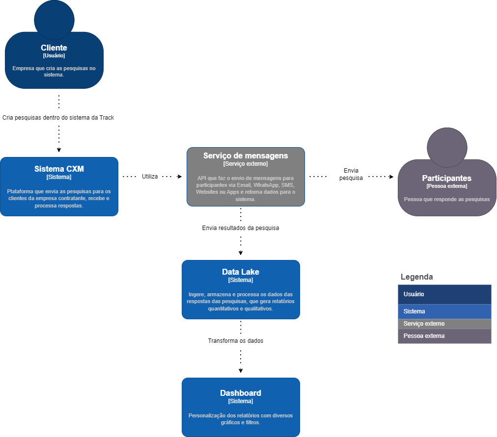

# Documentação de arquitetura 

### Plano e definição dos testes

| Tipo         | Nome                               | Descrição                                                                 | Dados de entrada                                           | Passos                                                                                                                                                                                                                                         | Dados de Saída                         | Resultado esperado                                               | Justificativa                                                                                                                                                                    |
|--------------|------------------------------------|---------------------------------------------------------------------------|-------------------------------------------------------------|------------------------------------------------------------------------------------------------------------------------------------------------------------------------------------------------------------------------------------------------|---------------------------------------|------------------------------------------------------------------|-------------------------------------------------------------------------------------------------------------------------------------------------------------------------------------|
| Caixa Preta  | Acesso ao menu de widgets          | Validar se o menu de widgets é acessível a partir da interface principal. | Credenciais de usuário se necessário                        | 1. Realizar login se necessário.<br>2. Navegar até o menu lateral.<br>3. Localizar e clicar na opção “Widgets”.                                                                                                                                | Visualização do submenu de Widgets.   | O submenu de Widgets deve ser exibido sem erros.                  | Verifica a acessibilidade e visibilidade do menu de widgets componente essencial para a gestão de widgets.                                                                         |
| Unitário     | Criação de widget                  | Verificar o processo de criação de um novo widget e se todos os campos necessários estão funcionando conforme esperado. | Nome do widget                                                | 1. Acessar o menu de widgets.<br>2. Clicar em “Novo widget”.<br>3. Inserir as configurações necessárias e nomear o widget.<br>4. Salvar o novo widget.                                                                                       | Confirmação de criação do widget.     | O widget é criado com as configurações fornecidas e um aviso de sucesso é apresentado. | Assegura que a funcionalidade de criação de widgets funciona isoladamente sem erros.                                        |
| Integração   | Abrir widget                       | Confirmar que o widget pode ser aberto e visualizado após a criação.      | Identificação do widget criado                               | 1. Localizar o widget criado na lista de widgets disponíveis.<br>2. Clicar para abrir o widget.                                                                                                                                                | Interface do widget aberto.           | O widget abre corretamente e mostra todas as informações e configurações aplicadas. | Testa a integração da funcionalidade de visualização de um widget após sua criação.                                         |
| Caixa Preta  | Responder pesquisa no widget       | Confirmar as respostas das perguntas são gravadas e visíveis na tela de interação | Respostas das perguntas da pesquisa                         | 1. Responder a pesquisa<br>2. Verifique na tela de interações se a resposta foi registrada                                                                                                                                                     | Todos registros                       | Respostas finalizadas devem aparecer na tela de interação e as não finalizadas não devem aparecer | Valida a funcionalidade de submissão e registro de respostas no widget uma ação crítica do usuário.                          |
| Caixa Preta  | Verificar registro de interação    | Testar se uma interação individual é registrada corretamente após a resposta à pesquisa no widget. | Resposta submetida na pesquisa                               | 1. Responder a pesquisa no widget.<br>2. Acessar a tela de interações.<br>3. Procurar pela interação recente.                                                                                                                                  | Registro da interação na lista.       | A interação deve ser listada com os detalhes corretos na tela de interações. | Confirma que o registro de uma única resposta é processado e exibido corretamente.                                          |
| Caixa Preta | Verificar registro de interação   | Testar se uma interação individual é registrada corretamente após a resposta à pesquisa no widget. | Resposta submetida na pesquisa                        | 1. Responder a pesquisa no widget.<br>2. Acessar a tela de interações.<br>3. Procurar pela interação recente.                                                     | Registro da interação na lista.  | A interação deve ser listada com os detalhes corretos na tela de interações.          | Confirma que o registro de uma única resposta é processado e exibido corretamente.                                                          |
| Caixa Preta | Verificar registros de interações | Garantir que múltiplas interações sejam registradas e exibidas corretamente.                   | Múltiplas respostas submetidas nas pesquisas          | 1. Submeter várias respostas na pesquisa através do widget.<br>2. Acessar a tela de interações.<br>
| Caixa Preta | Validação de Dados no Widget  | Testar a validação de dados inseridos no widget.                          | Dados inválidos para a pesquisa | 1. Inserir dados inválidos na pesquisa do widget. <br>2. Tentar submeter a pesquisa.                    | Mensagem de erro ou feedback de validação.     | Mensagens de erro devem ser exibidas para entradas inválidas.                                       | Verifica se o sistema impede submissões de dados inválidos                                                                       |
| Unitário    | Desempenho do Widget          | Testar a velocidade de carregamento e resposta do widget.                 | -                               | 1. Carregar o widget. <br>2. Medir o tempo de resposta ao submeter uma pesquisa.                       | Tempo de carregamento e resposta.               | O widget deve carregar e responder dentro dos limites de tempo aceitáveis.                           | Assegura que o widget atende aos requisitos de desempenho e não afeta negativamente a experiência do usuário.                   |
| Integração  | Compatibilidade do Widget     | Verificar a compatibilidade do widget com diferentes navegadores.         | -                               | 1. Abrir o widget em diferentes navegadores. <br>2. Testar a funcionalidade completa em cada navegador. | Funcionalidade operante em todos os navegadores testados. | O widget deve funcionar corretamente em todos os navegadores populares.                              | Garante que usuários em diferentes plataformas tenham uma experiência consistente mantendo a integridade dos dados.             |
| Carga       | Resiliência do Widget sob Carga         | Testar como o widget se comporta sob carga pesada.                                                  | Número alto de submissões simultâneas         | 1. Simular múltiplos usuários submetendo pesquisas ao mesmo tempo. <br>2. Monitorar o desempenho do widget.                               | Comportamento do widget sob carga.            | O widget deve continuar operante e responsivo sob alta carga.                                 | Valida a estabilidade e escalabilidade do widget sob condições de pico de uso.                                                          |
| Caixa Preta | Localização e Internacionalização       | Testar se o widget suporta diferentes idiomas e formatos regionais.                                 | Configuração de idioma e região               | 1. Configurar o idioma e região do widget. <br>2. Verificar a exibição dos textos e formatos.                                             | Textos e formatos localizados exibidos corretamente. | O widget deve exibir a localização correta baseada nas configurações de idioma e região.        | Confirma que o widget é acessível e utilizável por usuários em diferentes locais.                            |
| Unitário    | Funcionalidade de Feedback do NPS       | Testar a funcionalidade de coleta de feedback adicional após o cálculo do NPS.                     | Feedback textual após a submissão da pesquisa | 1. Submeter uma pesquisa que resulte em status de promotor ou detrator. <br>2. Inserir feedback textual.                                 | Feedback textual registrado corretamente.     | Feedback textual deve ser registrado e associado ao NPS correspondente.                        | Garante que o sistema coleta feedback adicional para análise qualitativa juntamente com o NPS.                                           |
| Caixa Preta | Segurança do Widget                     | Testar a segurança do widget contra injeções de código e outros ataques.                            | Tentativas de injeção de script               | 1. Tentar inserir scripts ou SQL malicioso no widget. <br>2. Verificar se o sistema sanitiza ou rejeita entradas maliciosas.              | Nenhuma execução de script malicioso.          | O sistema deve rejeitar ou neutralizar entradas mal-intencionadas.                             | Previne vulnerabilidades de segurança e protege contra ataques comuns como Cross-site Scripting (XSS) e SQL Injection.                 |
| Integração  | Verificar Zona Crítica NPS Relacional   | Testar a lógica de cálculo do NPS Relacional na Zona Crítica.                                       | Respostas NPS Relacional que resultam em pontuação entre -100 e 0 | 1. Coletar respostas NPS Relacional dentro do filtro de período. <br>2. Calcular o N
| Integração  | Verificar Zona de Aperfeiçoamento NPS Relacional | Testar a lógica de cálculo do NPS Relacional na Zona de Aperfeiçoamento.                        | Respostas NPS Relacional que resultam em pontuação entre 1 e 50 | 1. Coletar respostas NPS Relacional dentro do filtro de período. <br>2. Calcular o NPS Relacional. <br>3. Verificar a zona correspondente ao resultado. | Zona NPS identificada     | Zona NPS deve ser identificada como 'Zona de Aperfeiçoamento' para pontuações entre 1 e 50.                  | Assegura que a aplicação classifica corretamente os resultados do NPS Relacional na Zona de Aperfeiçoamento.                     |
| Integração  | Verificar Zona de Qualidade NPS Relacional      | Testar a lógica de cálculo do NPS Relacional na Zona de Qualidade.                             | Respostas NPS Relacional que resultam em pontuação entre 51 e 75 | 1. Coletar respostas NPS Relacional dentro do filtro de período. <br>2. Calcular o NPS Relacional. <br>3. Verificar a zona correspondente ao resultado. | Zona NPS identificada     | Zona NPS deve ser identificada como 'Zona de Qualidade' para pontuações entre 51 e 75.                       | Confirma que a aplicação classifica corretamente os resultados do NPS Relacional na Zona de Qualidade.                                  |
| Integração  | Verificar Zona de Excelência NPS Relacional    | Testar a lógica de cálculo do NPS Relacional na Zona de Excelência.                            | Respostas NPS Relacional que resultam em pontuação entre 76 e 90 | 1. Coletar respostas NPS Relacional dentro do filtro de período. <br>2. Calcular o NPS Relacional. <br>3. Verificar a zona correspondente ao resultado. | Zona NPS identificada     | Zona NPS deve ser identificada como 'Zona de Excelência' para pontuações entre 76 e 90.                      | Verifica se a aplicação classifica corretamente os resultados do NPS Relacional na Zona de Excelência.                                   |
| Integração  | Verificar Zona de Encantamento NPS Relacional  | Testar a lógica de cálculo do NPS Relacional na Zona de Encantamento.                          | Respostas NPS Relacional que resultam em pontuação entre 91 e 100 | 1. Coletar respostas NPS Relacional dentro do filtro de período. <br>2. Calcular o NPS Relacional. <br


## Arquitetura C4 Model - Contexto

</img>

## Arquitetura C4 Model - Container

</img>

## Testes

### Implementação de testes
Ao decorrer da sprint, foi iniciado a realização dos testes unitários dos endpoints da aplicação, inicialmente planejado a maioria dos testes falham e depois com os ajustes e refatoração dos códigos de backend e testes é esperado que todos os testes rodem e passem.

O plano de testes conta com diversos tipos de teste, como, unitário, caixa preta e integração. Como parte do planejamento e organização de desenvolvimento apenas os unitários foram ininiciados e os demais irão ser produzidos ao decorrer da próxima sprint, com os conhecimentos adquiridos e o avanço do desenvolvimento do frontend, backend e o início das integrações.

Os testes que foram iniciados estão dentro da pasta: src/tests/src 

Utilização de práticas como design patters começou a ser implementação como forma de padrão da equipe ao longo desse projeto e será dado seguimento em todos os demais testes que serão produzidos para o projeto, padrões como esse são importantes e ajudam na organização e clareza nos códigos dos testes.

Para rodar os testes é necessário o uso do comando dentro da pasta de testes que possui o caminho acima:
Npm run jest

Os testes foram produzidos em TypeScript

Foram feitos os testes de Delete, Post, Get e Put, cada um com um propósito específico dentro da aplicação. Os testes de Delete visam garantir que os registros sejam removidos de forma eficaz, sem deixar resíduos ou afetar dados relacionados de forma indevida. Os testes de Post focam na correta inserção de novos dados, assegurando que todos os campos necessários sejam validados e que o novo registro seja criado conforme esperado. Já os testes de Get são projetados para verificar se a recuperação de informações está ocorrendo de maneira correta, seja de um único registro ou de um conjunto de dados, garantindo que os filtros e parâmetros de busca funcionem como previsto. Por fim, os testes de Put têm como objetivo validar as operações de atualização, certificando-se de que os dados existentes possam ser modificados adequadamente, mantendo a integridade e a consistência dos registros após as alterações.

### Validação de Fluxo Principal e Alternativo:
Ao decorrer do projeto iremos incorporar testes para validar tanto o fluxo principal quanto os fluxos alternativos de cada endpoint, assegurando uma cobertura abrangente de casos de uso. Isso inclui situações como inserções bem-sucedidas de dados (fluxo principal) e tratamento de entradas inválidas ou requisições malformadas (fluxos alternativos), aprimorando significativamente a robustez da nossa aplicação.

### Qualidade Geral e Coerência da Suíte de Testes
Nos esforçamos para manter uma alta qualidade e coesão em nossa suíte de testes, refletindo um compromisso contínuo com práticas de desenvolvimento orientadas a testes. A consistência e a confiabilidade dos testes são essenciais para a nossa confiança no software que estamos desenvolvendo, reforçando a importância de uma suíte de testes bem planejada e executada.

Ao seguir essas diretrizes e práticas, a equipe está não apenas melhorando a qualidade do código através de testes unitários eficazes, mas também estabelecendo um padrão de qualidade que passa por todo o ciclo de desenvolvimento do projeto.

## Testes de frontend

Os testes foram realizados com o uso do Cypress

Este documento fornece instruções sobre como executar a suíte de testes Cypress para a páginas de frontend.

## Pré-requisitos

Antes de começar, certifique-se de ter o Node.js instalado em sua máquina. Cypress é um framework de testes baseado em Node.js.

### a) Clone da solução

Para obter o projeto em sua máquina local, clonar esse repositório do GitHub

### b) Restauração de pacotes

npm install

### c) Execução dos da suíte

npx cypress open

## Testes Realizados e estrutura

Foram realizados testes para as principais partes do frontend, a seguir estão um trecho de código com um exemplo de um teste realizado para a página de formulário 

```
    it('should display the label of link', () => {
        cy.get('form > :nth-child(2)').should(
        'contain', 'Link do Widget', 'contain', 'placeholder', 'Ex: https://forms.gle/123456');
      });
````

e a seguir está os resultados dos testes apresentados no Cypress

</img>

</img>