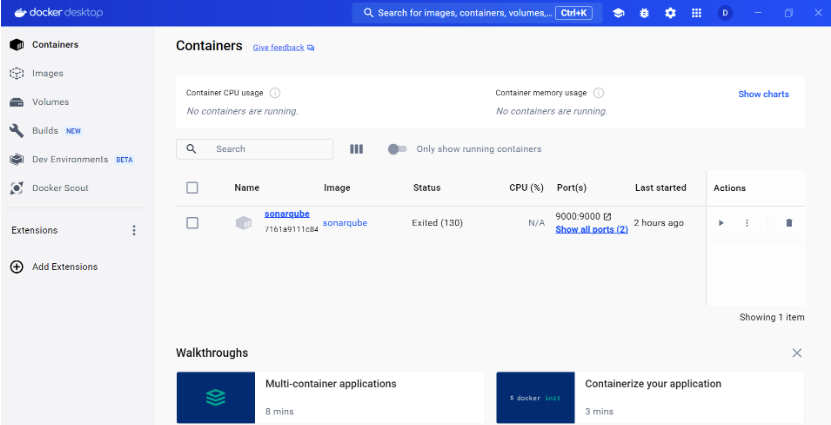
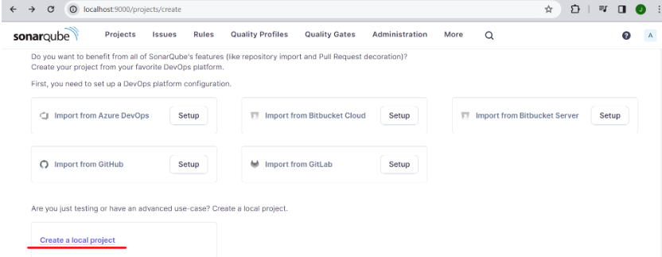
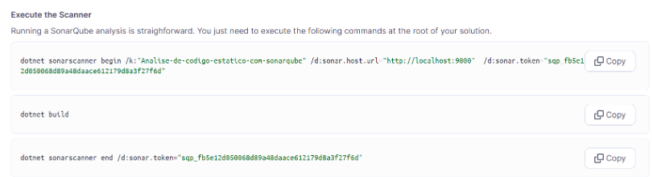
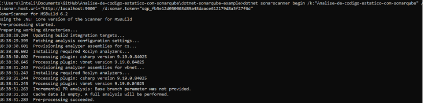
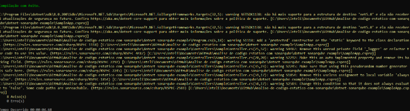
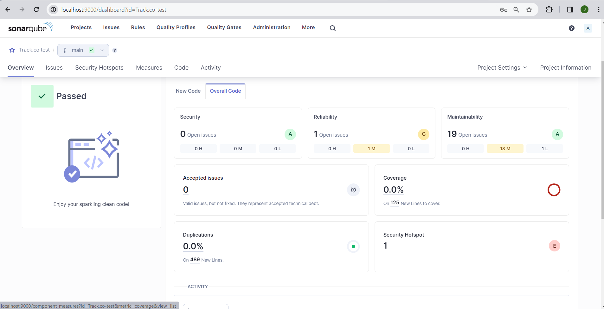
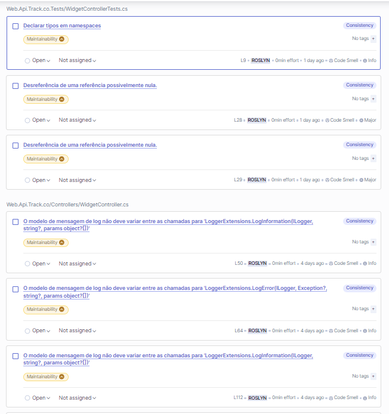
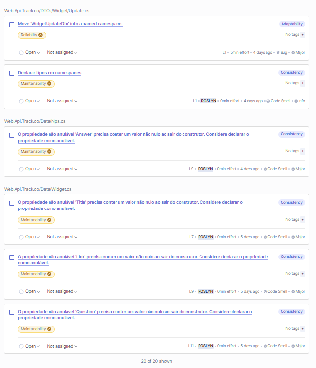
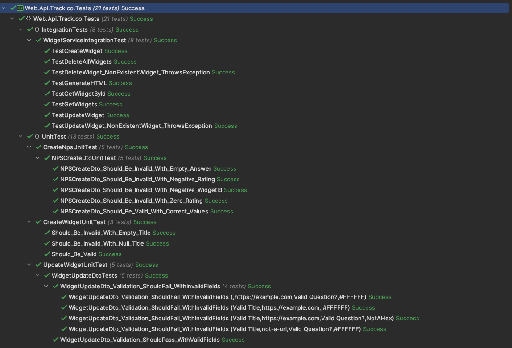

# Projeto de Testes Automatizados
<p align="center">
<a href= "https://www.inteli.edu.br/"></a>
</p>

**Nome do Projeto:** Projeto de testes automatizados

**Nome do Parceiro:** Track.io

**Nome do Grupo:** Grupo 4

**Integrantes do grupo:**

- <a href="https://www.linkedin.com/in/daniel-eduardocunha/">Daniel Cunha</a>
- <a href="https://www.linkedin.com/in/jo%C3%A3o-lucas-gonzalez/">João Lucas Gonzalez</a>
- <a href="https://www.linkedin.com/in/marcelofeitoza7/">Marcelo Feitoza</a>
- <a href="https://www.linkedin.com/in/marcos-florencio-n/">Marcos Florencio</a>
- <a href="https://www.linkedin.com/in/mariana-silva-paula/">Mariana Silva de Paula</a>
- <a href="https://www.linkedin.com/in/mike-mouadeb/">Mike Mouadeb</a>
- <a href="https://www.linkedin.com/in/sophia-de-oliveira-tosar-aba7ab23b/">Sophia Tosar</a>
- <a href="https://www.linkedin.com/in/wagner-estevam/">Wagner Estevam</a>


## Requisitos
Requisitos funcionais:

### Requisito funcional 1

a) Título: Implementação de Testes Automatizados para Funcionalidades Críticas do sistema:

b) Descrição detalhada do processo a ser digitalizado:

Desenvolver e integrar testes automatizados para funcionalidades essenciais da plataforma, como Pesquisas, Dashboards, Distribuição e Interação, visando detectar problemas rapidamente e garantir a estabilidade e confiabilidade da plataforma. Isso inclui a criação de scripts de teste que simulam interações do usuário e validam o comportamento esperado da aplicação. Esses testes serão integrados ao framework de automação Cypress, permitindo sua execução automática e repetitiva, assegurando que qualquer regressão ou erro seja rapidamente identificado e corrigido antes do lançamento, assim garantindo a maior satisfação do usuário sobre o uso da plataforma.

c) Descrição do fluxo principal

O processo inicia-se pela seleção das funcionalidades que serão submetidas a testes. Posteriormente, desenvolvem-se scripts de teste que simularão as operações no sistema (dado que o acesso ao código fonte não está disponível), utilizando o framework Cypress para essa finalidade. Após a execução dos testes, os resultados são analisados. Caso se identifiquem falhas, a estratégia será aprimorar a simulação para mitigar esses erros em futuras séries de testes, visando uma melhoria contínua do processo. Todas essas estratégias de melhoria serão documentadas com o objetivo de promover insights para os clientes melhorarem sua plataforma e seu sistema de teste.

d) Descrição do fluxo alternativo:

Se identificarem falhas nos testes automatizados em componentes específicos, essas áreas deverão ser examinadas manualmente através de testes unitários e de integração, para assegurar uma avaliação detalhada. Esta abordagem permite uma investigação aprofundada das funcionalidades envolvidas, garantindo que todos os aspectos do sistema sejam rigorosamente verificados e que qualquer discrepância seja corrigida, assegurando assim a qualidade e a integridade do sistema.

e) Descrição do fluxo de exceção:

Se um teste automatizado falhar repetidamente sem uma causa identificável nos códigos ou funcionalidades testadas, o script de teste e simulação são revisados para verificar a possibilidade de falha ou inadequação do testes. Ajustes são feitos no script ou no ambiente de teste conforme necessário. Se o problema persistir, uma investigação mais profunda deve ser realizada para identificar possíveis defeitos no código que não foram previstos inicialmente. Todos os testes devem seguir padrões de qualidade, incluindo clareza na descrição das funcionalidades testadas e precisão na detecção de falhas. Os scripts devem ser mantidos atualizados com as últimas versões das funcionalidades simuladas para garantir a cobertura de teste contínua e relevante.

### Requisito funcional 2

a) Título: Implementação e Validação de Widget de Pesquisa.

b) Descrição detalhada do processo a ser digitalizado:

O processo envolve a configuração de um widget de pesquisa personalizado em um site que o grupo irá criar para simular o ambiente, permitindo a coleta de feedback dos usuários. Inicia-se com a ativação da função do widget, a nomeação, e a especificação da URL do site onde será hospedado. Após selecionar a pesquisa desejada, o widget é salvo e pronto para interação dos usuários no site.

c) Descrição do fluxo principal:

Acessar o painel de controle e navegar até a opção de widgets. Clicar em “Novo widget” e ativar a flag do Widget. Nomear o Widget e adicionar a URL do site. Selecionar a pesquisa a ser vinculada ao widget. Salvar as configurações clicando em “Salvar e Continuar”. Acessar o site para responder à pesquisa através do widget.

d) Descrição do fluxo alternativo:

Caso o site específico não aceite o formato do widget, iremos buscar alternativas para a hospedagem do arquivo HTML, como plataformas de hospedagem simplificadas (ex: tiiny.site).

e) Descrição do fluxo de exceção:

Descrição do fluxo de exceção: Se a resposta à pesquisa não for finalizada ou enviada corretamente pelo usuário (por exemplo, falha na conexão de internet), o sistema não deve registrar essa interação como válida. O sistema deve ser capaz de identificar e descartar tentativas incompletas, garantindo que apenas feedbacks completos sejam contabilizados. Todas as interações e dados coletados devem seguir a LGPD, assegurando a confidencialidade e integridade das informações dos usuários. O sistema deve ser robusto, capaz de lidar com altos volumes de acessos simultâneos. Além disso, proporcionar um sistema de pesquisa que se integre de maneira sutil à experiência do usuário, evitando interrupções ou distrações significativas durante sua navegação no site.

### Requisito funcional 3

a) Título: Implementação de Dashboard de Análise de Dados.

b) Descrição detalhada do processo a ser digitalizado:

O processo envolve a criação de um dashboard para análise de dados, que permita a visualização de informações relevantes sobre o uso da plataforma. Inicia-se com a seleção dos dados a serem exibidos, a definição de filtros e a escolha dos gráficos e tabelas a serem utilizados. O dashboard deve ser configurado para atualizar automaticamente, permitindo que os usuários visualizem informações em tempo real.

c) Descrição do fluxo principal:

Acessar o painel de controle e navegar até a opção de dashboards. Clicar em “Novo dashboard” e selecionar os dados a serem exibidos. Definir os filtros e a ordem de exibição dos gráficos e tabelas. Configurar a atualização automática do dashboard. Salvar as configurações clicando em “Salvar e Continuar”.

d) Descrição do fluxo alternativo:

Caso a plataforma não ofereça a opção de criação de dashboards, iremos buscar alternativas para a visualização dos dados, como a utilização de ferramentas de terceiros que permitam a integração com a plataforma.

e) Descrição do fluxo de exceção:

Se a atualização automática do dashboard falhar, o sistema deve ser capaz de identificar e corrigir o problema automaticamente, garantindo que as informações exibidas sejam sempre atualizadas e confiáveis. Além disso, o sistema deve ser capaz de lidar com grandes volumes de dados, garantindo que a visualização das informações seja rápida e eficiente. O dashboard deve ser intuitivo e de fácil utilização, permitindo que os usuários encontrem as informações desejadas de forma rápida e eficiente.

## Métricas dos testes

## Sprint 2:

### Front-End:

Testes Cypress:

### Back-End:

#### Sonarqube:

* O Sonarqube é um ferramenta utilizada para testar a qualidade do código por meio de baterias de testes feitas no repositório. Ele detecta problemas como bugs, vulnerabilidades, "code smells" e duplicidade de código. Por meio desses insights é possível realizar a refatoração do código afim de melhorar seu funcionamente e sua qualidade. A plataforma oferece um dashboard intuitivo que apresenta métricas e insights, facilitando a identificação e correção de problemas no código de forma eficiente.

###### Passos para executar os testes no sonarqube:

1. Criar um container no docker para executar localmente o sonarqube por meio do comando 
   
   ```docker run -d --name sonarqube -p 9000:9000 -p 9092:9092 sonarqube```

</img>

ilustração da interface do SonarQube após a análise doum projeto, destacando um resultado global 'Passed'. Indica que não há problemas críticos, com 0% de duplicação de código e uma cobertura de testes em 0%, o que sugere a necessidade de implementar testes para cobrir 125 novas linhas de código. Existem 19 questões abertas relacionadas à manutenibilidade, categorizadas como 'C', e um hotspot de segurança marcado como 'E', o que pode exigir uma atenção imediata. Não há problemas de confiabilidade, mas mostra áreas que precisam de melhorias para alcançar uma qualidade de código mais robusta.

2. Após a execução do container entrei na porta 9000 e criei um projeto local.

</img>

1. Ao criar o projeto foi gerado um token. Para executar os testes copiei os comandos da na imagem abaixo e colei no caminho onde a solução “SampleApp” se encontra.


</img>

Resultado obtido no terminal: 

</img>

</img>

###### Resultados dos testes no sonarqube: 

</img>

</img>

</img>

</img>

## Testes de integração

Testes de integração realizados para verificar a interação entre diferentes componentes do sistema. Eles são usados para testar a integração entre módulos de software, garantindo que eles funcionem juntos corretamente. Os testes de integração são realizados após os testes unitários e antes dos testes de sistema. Eles são usados para verificar se os módulos de software funcionam juntos corretamente, garantindo que o sistema funcione como um todo.



### WidgetServiceIntegrationTest

Esta classe de teste integração verifica a correta funcionalidade do serviço `WidgetService` em conjunto com o banco de dados `AppDbContext`.

#### Configuração de Teste

Inicialmente, configuramos os `ILogger` e `IConfiguration` com valores mockados para simular o ambiente da aplicação. A string de conexão do banco de dados é definida para um banco de dados em memória.

#### Testes Realizados

- **TestCreateWidget**: Verifica se widgets são criados corretamente e se as respostas NPS são associadas a eles.

- **TestGetWidgets**: Confirma que a lista de todos os widgets é recuperada com sucesso.

- **TestGetWidgetById**: Assegura que um widget específico pode ser recuperado pelo seu ID.

- **TestUpdateWidget**: Testa a funcionalidade de atualização de um widget, verificando se os novos valores são corretamente armazenados.

- **TestGenerateHTML**: Checa se o HTML gerado para um widget contém as informações corretas.

- **TestUpdateWidget_NonExistentWidget_ThrowsException**: Garante que uma exceção é lançada ao tentar atualizar um widget que não existe.

- **TestDeleteWidget_NonExistentWidget_ThrowsException**: Certifica-se de que uma exceção é lançada ao tentar deletar um widget que não existe.

- **TestDeleteAllWidgets**: Verifica se todos os widgets podem ser deletados sem problemas.

Cada método de teste inclui passos de configuração (Arrange), ação (Act) e asserção (Assert) para garantir que os componentes estão trabalhando como esperado. Os logs são gerados para cada etapa significativa do processo de teste para facilitar a depuração e o rastreamento de erros.

Quando os testes são executados, esperamos que todos passem, como indicado pela imagem fornecida dos resultados dos testes. Esta documentação pode ser expandida para incluir descrições adicionais e resultados esperados para cada teste conforme necessário.

### CreateNpsUnitTest

Esta classe de testes verifica a validação de `NPSCreateDto`, que é usada para criar registros NPS (Net Promoter Score).

#### NPSCreateDtoUnitTest

- **NPSCreateDto_Should_Be_Valid_With_Correct_Values**: Garante que o `NPSCreateDto` é válido quando todos os campos são fornecidos corretamente.

- **NPSCreateDto_Should_Be_Invalid_With_Negative_WidgetId**: Verifica que o `NPSCreateDto` é inválido se o `WidgetId` fornecido é negativo.

- **NPSCreateDto_Should_Be_Invalid_With_Empty_Answer**: Certifica que o `NPSCreateDto` é inválido se a resposta fornecida está vazia.

- **NPSCreateDto_Should_Be_Invalid_With_Negative_Rating**: Assegura que o `NPSCreateDto` é inválido se a avaliação fornecida é negativa.

- **NPSCreateDto_Should_Be_Invalid_With_Zero_Rating**: Confirma que o `NPSCreateDto` é inválido se a avaliação fornecida é zero.

Cada método de teste utiliza a função `Validate` do `NPSCreateDto` para determinar a validade dos dados inseridos. Assertivas são utilizadas para verificar se o estado `IsValid` do `NPSCreateDto` reflete corretamente a validade dos dados de acordo com as regras de negócio definidas.

Esta classe de teste unitário se concentra em validar a criação de objetos `WidgetCreateDto`, que são utilizados para criar widgets.

#### Testes

- **Should_Be_Valid**: Confirma que o `WidgetCreateDto` é considerado válido quando todos os campos necessários são fornecidos e estão corretos.

- **Should_Be_Invalid_With_Empty_Title**: Verifica que o `WidgetCreateDto` é inválido se o campo `Title` está vazio. Também testa implicitamente a validade de um link vazio e uma pergunta vazia.

- **Should_Be_Invalid_With_Null_Title**: Assegura que o `WidgetCreateDto` é inválido se o campo `Title` é `null`. Semelhante ao teste anterior, também avalia um link vazio e uma pergunta vazia.

Cada teste utiliza a propriedade `IsValid` do `WidgetCreateDto` para verificar se as regras de validação estão sendo aplicadas corretamente. O método `Validate` é chamado para atualizar o estado de `IsValid` antes das assertivas.

### UpdateWidgetUnitTest

A classe `UpdateWidgetUnitTest` valida o `WidgetUpdateDto`, responsável pelas operações de atualização de widgets na aplicação.

#### WidgetUpdateDtoTests

- **WidgetUpdateDto_Validation_ShouldPass_WithValidFields**: Garante que o `WidgetUpdateDto` é considerado válido quando todos os campos (título, link, pergunta, cor) são fornecidos com valores corretos.

- **WidgetUpdateDto_Validation_ShouldFail_WithInvalidFields**: Utiliza múltiplos cenários de dados (DataRow) para testar a validação de campos inválidos, incluindo:
    - Título nulo
    - Link que não é uma URL válida
    - Pergunta nula
    - Cor que não é um valor hexadecimal válido

Cada teste chama o método `Validate` e verifica o estado da propriedade `IsValid` para determinar se o `WidgetUpdateDto` cumpre os critérios de validação definidos para atualização de widgets. Testes com DataRow permitem verificar múltiplas condições de falha em um único teste.
