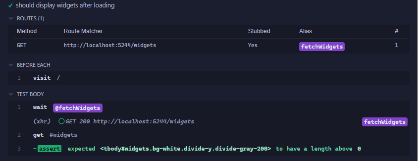
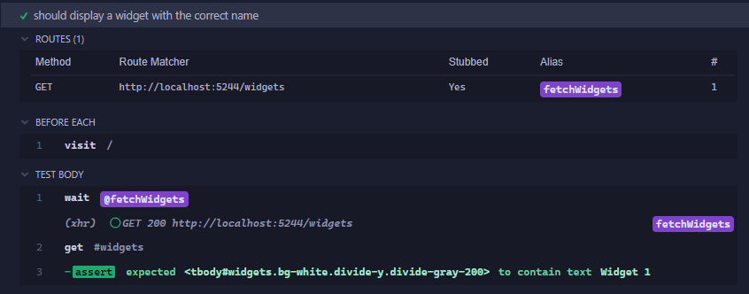
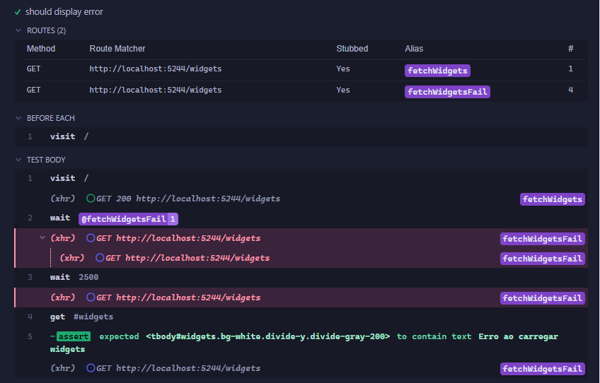
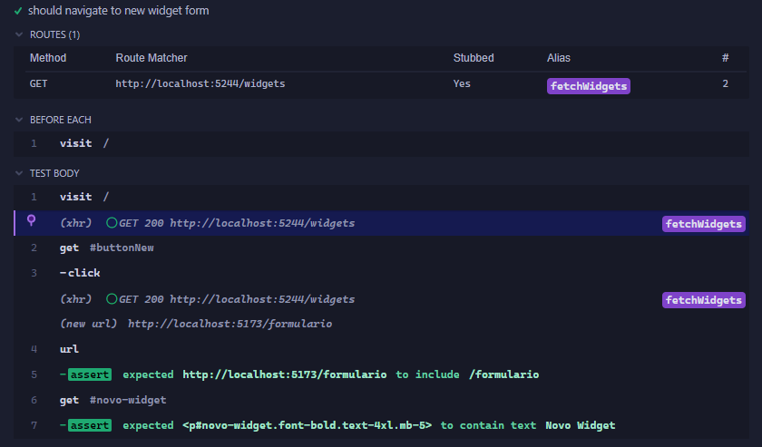
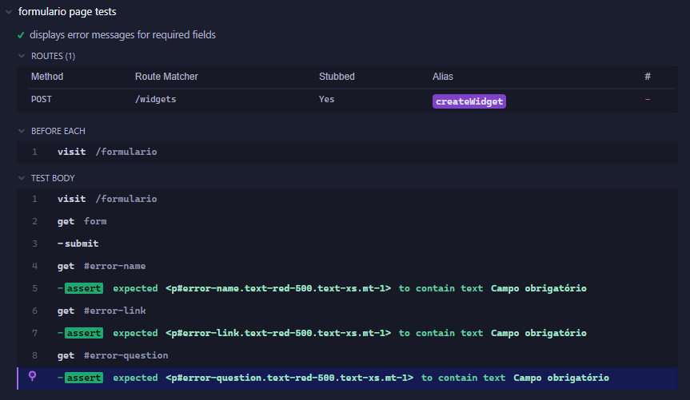
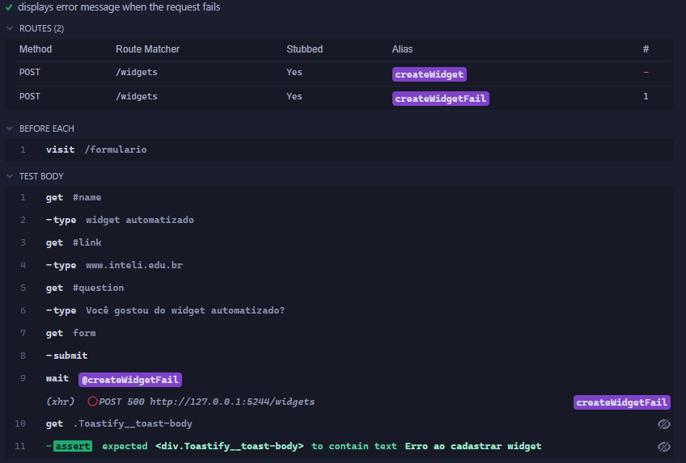
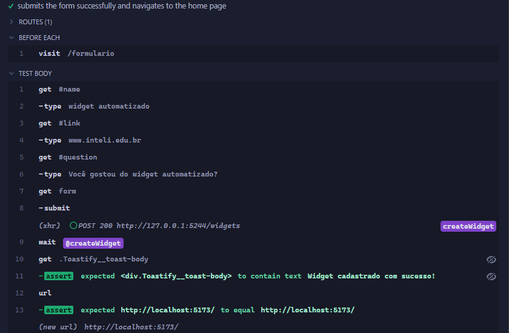
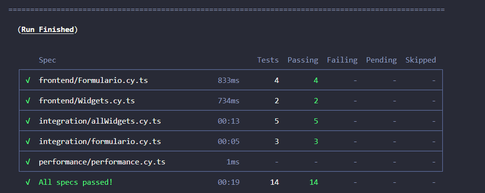

## Testes de integração Frontend

### Tecnologia e visualização dos testes

A elaboração dos testes de integração no frontend foi realizada utilizando o Cypress, um framework robusto com um conjunto abrangente de ferramentas para escrever, executar, depurar e gravar testes de aplicações web. 

Para executar e visualizar os testes, é necessário, primeiramente, executar o comando `npm i` dentro da pasta frontend do projeto. Após a atualização dos pacotes utilizados no projeto, há dois comandos disponíveis para a execução dos testes: `npx cypress run`, que executa todos os testes e permite visualizar o resultado no terminal; e `npx cypress open`, que abre o terminal do Cypress e permite visualizar no navegador os testes disponíveis, além de executar os testes desejados com a visualização do processo em tempo real.

### Testes Realizados

#### Display widgets

O primeiro teste verifica se ao entrar na página inicial e realizar a requisição para a api retornar os widgets, eles são renderizados na tela ou não, esse teste verifica a interação entre a api e como o componente que renderiza essas informações se comporta.

#### Dados corretos

Complementando o teste anterior, enquanto no teste acima ele verifica se a lista de widgets é renderizada após o retorno do api, esse verifica se os dados renderizados são os mesmos que espera-se receber do backend, para execução desses testes é realizado um mock com o arquivo json do que é esperado receber da api, e verifica-se se as informações dispostas na página são as mesmas do arquivo json em mock.

#### Erro na requisição dos widgets

Ainda na página de widgets, com finalidade de verificar o comportamento da página em caso de erro na requisição, o teste realizada uma chamda na api, mas com retorno pré determinado de um status code de erro, com esse erro na requisição da api, é verificado se a página sinaliza a mensagem de erro para o usuário. 

#### Navegação entre componentes de diferentes páginas

O teste valida se ao clicar no botão de novo widget na página de widgets, primeiro, se o ele direciona para a url correta de criação de novo widget, e se ao ser redirecionado, o formulário de criação é renderizado na tela.

#### Campos obrigatórios

Na tela de criação de widget, verifica se ao tentar submeter a criação de um novo widget sem o preenchimento dos campos obrigatórios, é retornada a mensagem de erro solicitando o preenchimento do campo.

#### Erro ao criar novo widget

Ainda na página de criar novo widget, com finalidade de verificar o comportamento da página em caso de erro na requisição ao submeter um novo widget, o teste realizada uma chamda na api, mas com retorno pré determinado de um status code de erro, com esse erro na requisição da api, é verificado se a página sinaliza a mensagem de erro para o usuário.

#### Criar novo widget

O script preenche os campos do formulário para criação do novo widget, depois é submetido ao pressionar o botão de enviar, que envia uma requisição POST com os dados, que retorna um status code de sucesso, o teste então verifica se a mensagem de criação com sucesso é disponibilizada na página para o usuário e se ela é redirecionada para a página inicial com todos os widgets.

### Resultados 

